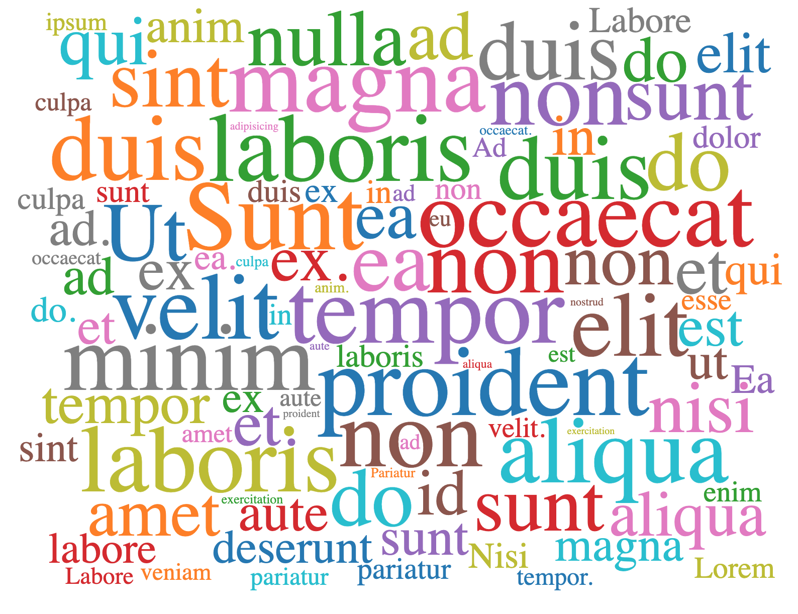

# D3 Word Cloud Element
D3 Word Cloud for Lit Element built upon d3-cloud



# Installation
```
npm install --save d3-cloud-element
```
# Usage
```ts
import { LitElement, html, customElement, property } from 'lit-element'
import 'd3-cloud-element'
@customElement('demo-element')
export default class DemoElement extends LitElement {
  data: any = []

  @property({ type: Number })
  width = 700

  constructor() {
    super()
    const str = 'Exercitation duis ex laboris laboris est aliqua Lorem veniam ad. Minim aliqua enim do exercitation duis eiusmod sunt do exercitation qui ex. Aliqua velit sunt in commodo anim. Sunt labore sunt dolor exercitation non commodo laboris culpa culpa exercitation ex proident laborum.\n\nId dolore commodo occaecat in velit. Aliqua mollit ea qui ad aute est excepteur non aliqua occaecat ad non ea. Labore incididunt excepteur tempor culpa proident ex commodo. Nisi nostrud tempor deserunt ipsum adipisicing aute do adipisicing.\n\nOfficia pariatur eiusmod tempor magna occaecat. Ut proident anim aute aliquip pariatur et. Pariatur ad ea sint ut excepteur amet id do. Labore eu velit non cillum nulla.\n\nIncididunt duis tempor sunt dolor magna occaecat esse elit consequat. Ea sint et labore amet ullamco non tempor. Ad voluptate nisi duis minim elit in adipisicing et laboris nulla culpa ad'
    this.data = str.split(' ').map((d) => {
      return { text: d, value: 10 + Math.random() * 90, fill: '0' };
    })
  }

  @property({ type: Boolean })
  useWordMouseOverEvent = true

  updateProps() {
    this.width = 900
    this.useWordMouseOverEvent = false
  }

  onWordClick (e: Event) {
    console.log(e)
  }
  render() {
    return html`
      <button
        @click=${this.updateProps}
      >
        Update Props
      </button>
      <d3-cloud-element
        .width="${this.width}"
        .height="${600}"
        .data="${this.data}"
        .autoFill="${true}"
        .useWordClickEvent=${false}
        .useWordMouseOverEvent=${this.useWordMouseOverEvent}
        @wordMouseOver="${this.onWordClick}"
      ></d3-cloud-element>
    `
  }
}

```
# Props
| Name           | Description                                                                                                | Type                                          | Required | Default             |
|----------------|------------------------------------------------------------------------------------------------------------|-----------------------------------------------|----------|---------------------|
| data           | The input data for rendering                                                                               | Array<{ text: string, value: number }>        |     ✓    |                     |
| width          | Width of component (px)                                                                                    | number                                        |          | 700                 |
| height         | Height of component (px)                                                                                   | number                                        |          | 600                 |
| fontSizeMapper | Map each element of data to font size (px)                                                                 | Function: (word: string, idx: number): number |          | word => word.value; |
| rotate         | Map each element of data to font rotation degree. Or simply provide a number for global rotation. (degree) | Function \| number                            |          | 0                   |
| padding        | Map each element of data to font padding. Or simply provide a number for global padding. (px)              | Function \| number                            |          | 5                   |
| font           | The font of text shown                                                                                     | Function \| string                            |          | serif               |
| autoFill       | Whether texts should be fill with random color or not                                                      | boolean                                       |          | false               |

# Events
| Name          | Description                                              | Payload                           |
|---------------|----------------------------------------------------------|-----------------------------------|
| wordClick     | Event triggered when click event triggered on a word     | { event: MouseEvent, word: Word } |
| wordMouseOver | Event triggered when mouseover event triggered on a word | { event: MouseEvent, word: Word } |
| wordMouseOut  | Event triggered when mouseout event triggered on a word  | { event: MouseEvent, word: Word } |

> The `Word` interface imported from `d3-cloud`

You can slightly improve performance by disable which event you don't use by passing the following values:
| Name | Description | Type | Default value |
|-|-|-|-|
| useWordClickEvent | Whether to use `wordClick` | boolean | true |
| useWordMouseOverEvent | Whether to use `wordMouseOver` | boolean | true |
| useWordMouseOutEvent | Whether to use `wordMouseOut` | boolean | true |

# Example
Run the following commands to start sample project:
```
npm run dev
```
Then open `/src/demo-element.ts` and update the import:
```ts
import './d3-cloud-element' // update to this
```
# Thanks
This project is built with the idea of [React D3 Cloud](https://github.com/Yoctol/react-d3-cloud)